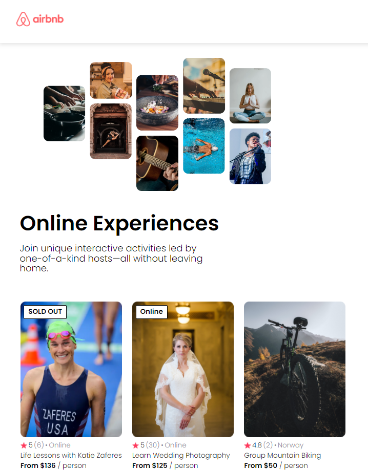

## AirBnb experience Page Clone (Static) Using React
- This is a static data driven website created using React.
- This helps a beginner to understand reusabaility of React components using Props.
- Data is taken from the hard coded data file.

## Used: HTML, CSS, React.

## Run Commands
- npm install
- npm run dev

<u>Image:</u>

